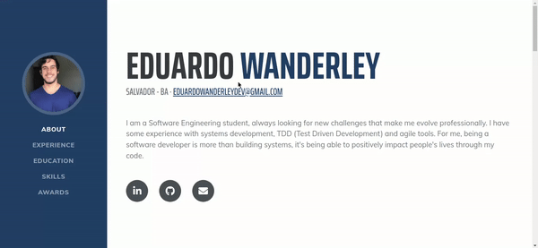

<h1 align="center"><a id="user-content---sobre-o-projeto-" class="anchor" aria-hidden="true" href="#--sobre-o-projeto-"><svg class="octicon octicon-link" viewBox="0 0 16 16" version="1.1" width="16" height="16" aria-hidden="true"><path fill-rule="evenodd" d="M7.775 3.275a.75.75 0 001.06 1.06l1.25-1.25a2 2 0 112.83 2.83l-2.5 2.5a2 2 0 01-2.83 0 .75.75 0 00-1.06 1.06 3.5 3.5 0 004.95 0l2.5-2.5a3.5 3.5 0 00-4.95-4.95l-1.25 1.25zm-4.69 9.64a2 2 0 010-2.83l2.5-2.5a2 2 0 012.83 0 .75.75 0 001.06-1.06 3.5 3.5 0 00-4.95 0l-2.5 2.5a3.5 3.5 0 004.95 4.95l1.25-1.25a.75.75 0 00-1.06-1.06l-1.25 1.25a2 2 0 01-2.83 0z"></path></svg></a> <g-emoji class="g-emoji" alias="computer" fallback-src="https://github.githubassets.com/images/icons/emoji/unicode/1f4bb.png"></g-emoji> About </h1>

# Personal presentation

## My personal website, where you can find all my professional information, such as courses, training, experiences, skills and others.

---

### Website

 

---
### Techs
The following technologies were used in the construction of the project:

- [HTML5](https://www.w3schools.com/tags/tag_doctype.asp)
- [CSS3](https://developer.mozilla.org/pt-BR/docs/Web/CSS)
- [Bootstrap](https://getbootstrap.com/docs/4.1/getting-started/introduction/)
- [Javascript](https://developer.mozilla.org/pt-BR/docs/Web/JavaScript)

---
### Author
<a href="https://github.com/eduardowanderleydev">
 
  
 <b>Eduardo Wanderley</b></a>

Contact : 👋🏽

